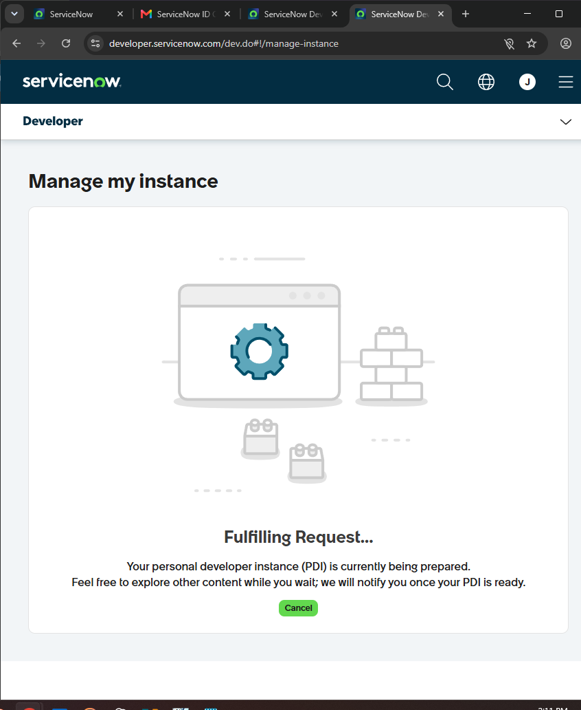
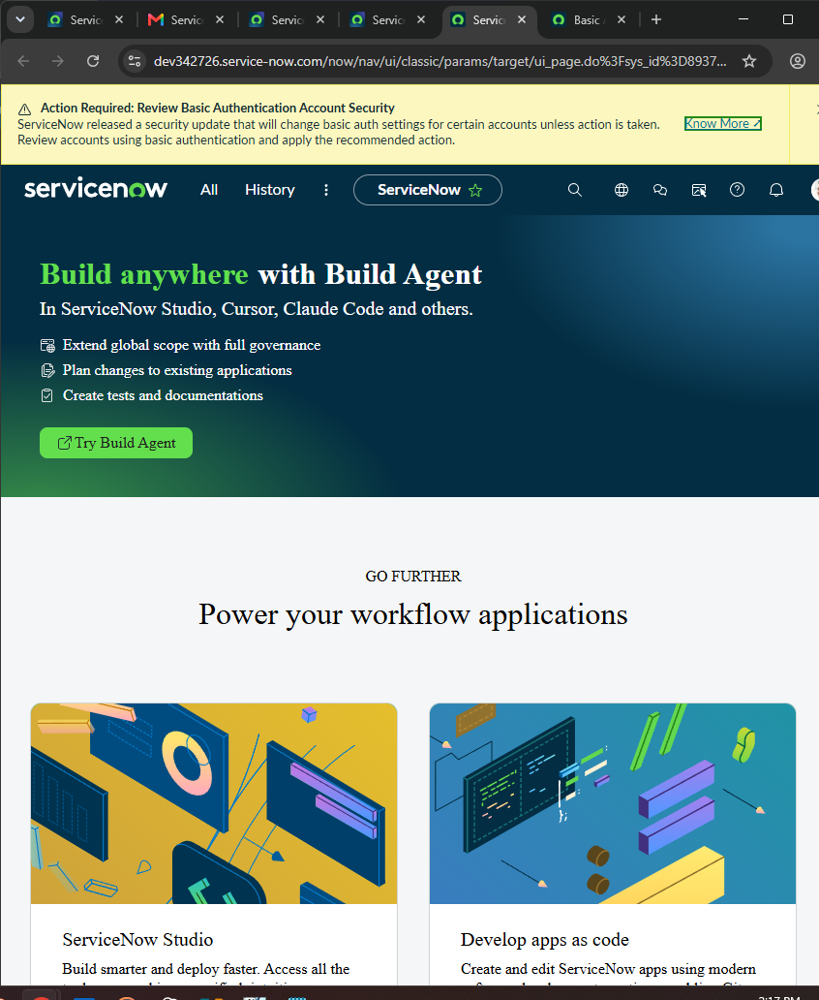
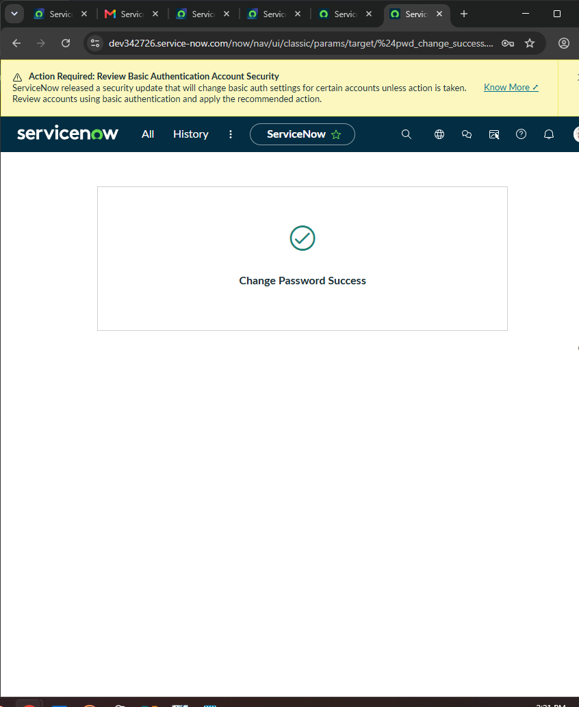
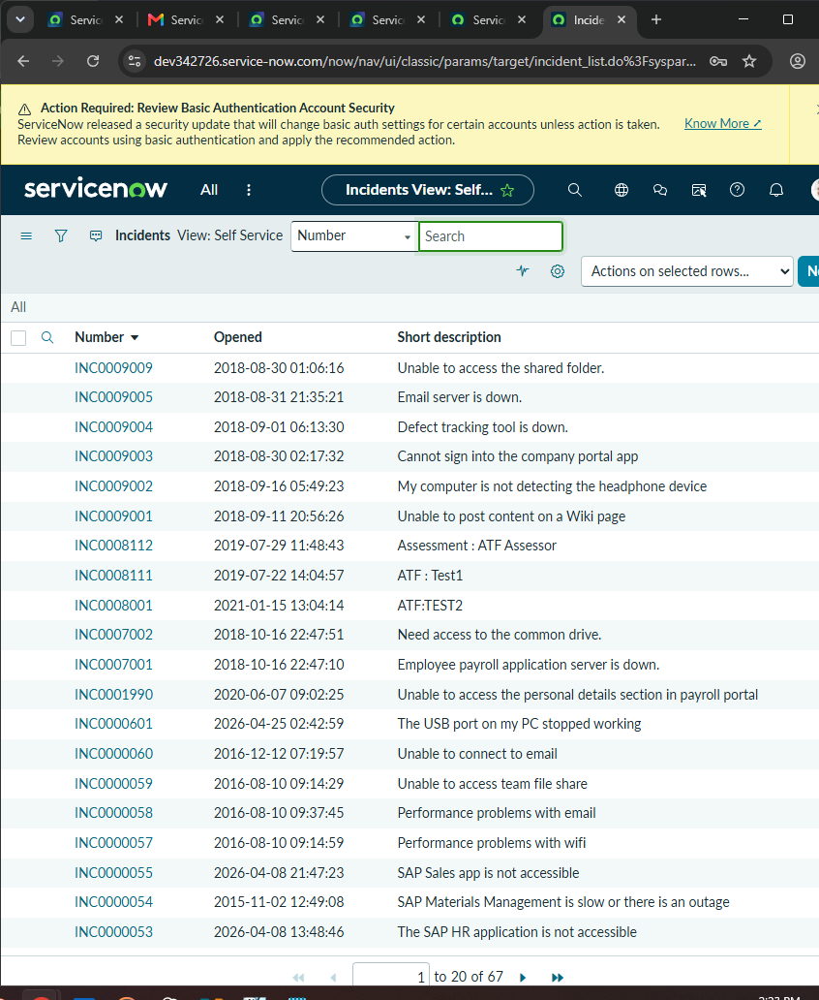
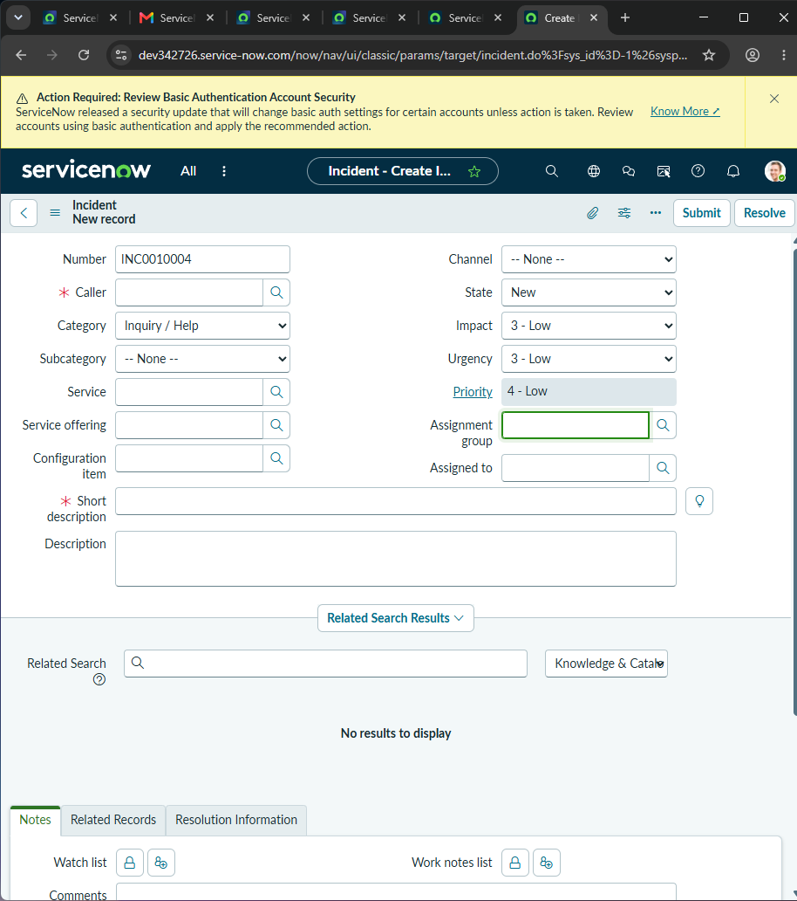
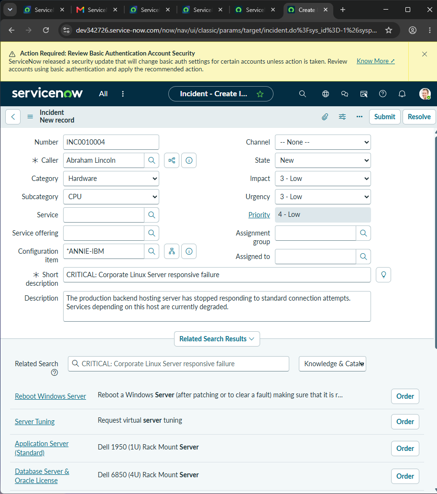

# ServiceNow ITIL ITSM Workspace & Instance Provisioning Project (2026)

## Project Overview
This project serves as a comprehensive, production-grade documentation of an enterprise-level IT Service Management (ITSM) environment and asset management pipeline configured within ServiceNow. Grounded in ITIL v4 frameworks, this deployment establishes a live cloud sandbox to simulate real-world service operations. 

The scope spans initial infrastructure provisioning, platform hardening, cross-module ticketing automation (Incident, Problem, and Change workflows), and master Configuration Management Database (CMDB) dependency mapping.

### Tools Used
* **ITSM Platform:** ServiceNow (Developer System Cloud)
* **Framework Alignment:** ITIL v4 Service Operations, Incident Control, & Configuration Management

---

## Technical Stack & Architecture

| Lifecycle Phase | Process Module | Target Asset / Entity |
| :--- | :--- | :--- |
| **Phase 1 & 2** | Instance Lifecycle & Security Management | Personal Developer Instance (PDI) Engine |
| **Phase 3** | Incident Management (ITIL Operations) | Record: `INC0010004` |
| **Phase 3** | Problem Management (Root-Cause Analysis) | Record: `PRB0040001` |
| **Phase 3** | Change Management (Infrastructure Governance) | Record: `CHG0030001` |
| **Phase 4** | Configuration Management (CMDB Asset Registry) | CI Entity: `*ANNIE-IBM` (Linux Server) |

---

## 📸 Step-by-Step System Rollout & Walkthrough

### Phase 1: Requesting and Provisioning the Service Instance

#### Step 1: Requesting a ServiceNow Personal Developer Instance (PDI)
Initializing the setup sequence by requesting an isolated cloud instance via the ServiceNow developer portal to establish our baseline deployment arena.

*Figure 1: Initializing the cloud instance infrastructure request.*

#### Step 2: Fulfilling the Infrastructure Request
Monitoring the automated backend cluster build process as the cloud provider provisions the custom virtual tenant space.

*Figure 2: Tracking live platform orchestration metrics during PDI initialization.*

#### Step 3: Extracting Administrator Credentials
Accessing the management console to securely retrieve the unique platform URL, master admin username, and temporary system-generated password.

*Figure 3: Secure administrative login data extraction.*

#### Step 4: Booting the Application Studio Workspace
Launching the primary Application Studio interface to verify access to development interfaces, integration APIs, and sandboxed schema layers.

*Figure 4: Verifying deployment access via App Studio dashboard.*

---

### Phase 2: Core Platform Configuration & Security Onboarding

#### Step 5: Enforcing the Administrative Password Update
Logging into the instance for the first time and performing an immediate translation of temporary system credentials to a hardened, enterprise-grade password.

*Figure 5: Overriding default system access vectors to establish secure system boundary controls.*

#### Step 6: Navigating to the Global Incident Records Engine
Utilizing the Filter Navigator to open the master Incident table ledger, confirming the global view handles live records efficiently.

*Figure 6: Navigating the central incident record table interface.*

---

### Phase 3: ITIL ITSM Live Ticket Automation Lifecycle

#### Step 7: Initializing a New Incident Record Form
Opening a blank incident form matrix to log an active hardware failure/disruption reported by an enterprise business unit.

*Figure 7: Generating live record context for operational incident INC0010004.*

#### Step 8: Documenting the Incident Scope and Details
Populating the incident record workspace with metadata: designating user parameters, identifying the degraded server configuration asset (`*ANNIE-IBM`), and mapping urgency indexes.

*Figure 8: Mapping business-impact variables to incident fields.*

#### Step 9: Committing the Ticket to the Live Incident Queue
Submitting the finalized incident form and auditing the primary incident queue to verify record `INC0010004` is actively indexed.

*Figure 9: Verifying active entry listing for incident tracking.*

#### Step 10: Initializing a Root-Cause Investigation (Problem Management)
Recognizing a systemic hardware pattern, the team opens a clean record inside the Problem Management matrix to launch a formal investigation into underlying causes.

*Figure 10: Transitioning operational focus from individual incident fix to systemic Problem root-cause profiling.*

#### Step 11: Mapping the Problem Scope and Infrastructure Asset
Formally linking record `PRB0040001` to the degraded server configuration item (`*ANNIE-IBM`) and outlining structural network interface card instabilities.

*Figure 11: Correlating infrastructural breakdowns directly to Problem tracking data blocks.*

#### Step 12: Committing the Record to the Global Problem Ledger
Submitting the completed problem file to index the investigation into the master ledger for tracking across engineering domains.

*Figure 12: Auditing the active problem tracking queue to confirm record initialization.*

#### Step 13: Initializing a New Change Request (Change Management)
To implement a permanent physical infrastructure remediation, a Change Request layout is initialized to shepherd the hardware change through governance review.

*Figure 13: Initializing standard enterprise change authorization object CHG0030001.*

#### Step 14: Documenting the Change Plan and Remediation Scope
Populating backout strategies, scheduling profiles, risk parameters, and scheduling hardware window adjustments to swap out the broken interface card on `*ANNIE-IBM`.

*Figure 14: Structuring mitigation and rollback procedures inside the governance record.*

#### Step 15: Committing the Change Record to the Master Governance Ledger
Committing the finished record to the active Change repository to await formal sign-off from the Change Advisory Board (CAB).

*Figure 15: Verifying deployment request CHG0030001 is queued and pending evaluation.*

---

### Phase 4: CMDB Asset Registry Configuration & Verification

#### Step 16: Initializing a CMDB Asset Record (Configuration Management)
Accessing the Configuration Management Database (CMDB) structure to register a fresh core bare-metal physical profile within the server category schema.

*Figure 16: Generating a blank Configuration Item (CI) card within the relational asset database.*

#### Step 17: Mapping Configuration Metrics to the Infrastructure CI
Populating key configuration attributes for the asset: Name (`ANNIE-IBM`), Asset Tag (`AST-2026-9982`), IP Networking Coordinates (`10.10.42.11`), and system OS architectures.

*Figure 17: Logging configuration baseline properties to guarantee data visibility.*

#### Step 18: Structuring Configuration Item Dependencies and Relationships
Utilizing the interactive CI Relationship Editor to construct relational parent/child dependency rules mapping server `*ANNIE-IBM` to neighboring routers and business engines.

*Figure 18: Mapping data-flow topology pathways within the relational CMDB fabric.*

#### Step 19: Final Baseline Verification of the CMDB Repository
Executing a direct system table query (`cmdb_ci_server_list.do`) to ensure the newly baseline-mapped server asset is discovery-ready, categorized, and functional.

*Figure 19: Auditing the final master production asset catalog to verify comprehensive tracking visibility.*
