# End-to-End ITIL ITSM Lifecycle Project: Incident, Problem, Change, & CMDB Management
An enterprise-grade IT Service Management (ITSM) implementation case study executed within the ServiceNow ecosystem. This portfolio project demonstrates a comprehensive understanding of ITIL frameworks by diagnosing an active infrastructure failure, identifying systemic root causes, deploying a risk-managed hardware change request, and configuring asset topologies within a Configuration Management Database (CMDB).

---

## 💻 Project Architecture & Workflow
1. **Incident Management:** Immediate restoration of a degraded production server to minimize business impact.
2. **Problem Management:** Root-cause analysis (RCA) to investigate systemic hardware failures.
3. **Change Management:** Standard/Normal change implementation blueprinting for a seamless hot-swap deployment.
4. **CMDB Configuration:** Provisioning asset records and setting up infrastructure dependency relationships.

---

## 📸 Technical Implementation Journal

### Step 1: Initiating the Outage Log
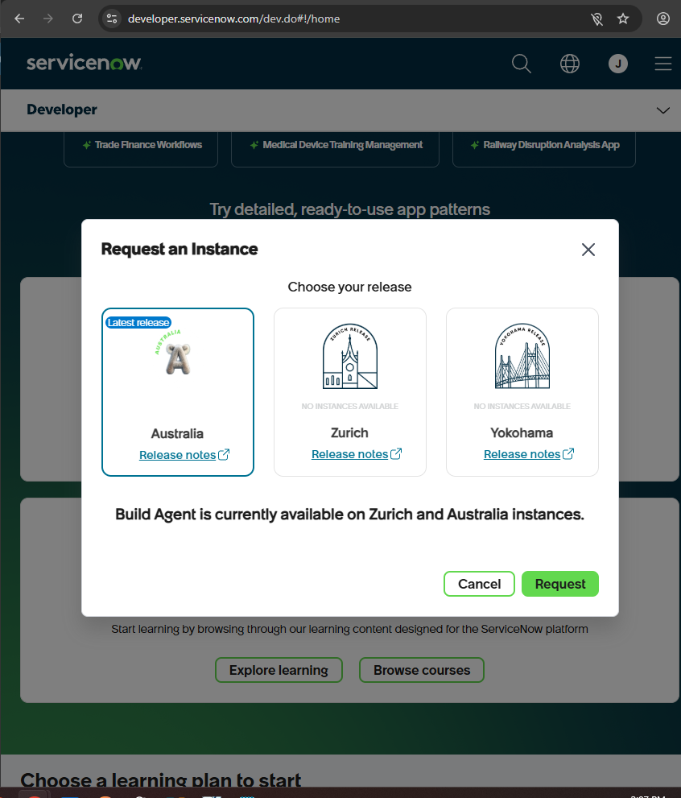
* **Caption:** Initializing an unpopulated Incident ticket workspace following an automated production server dropout alert.
* **Technical Context:** Created a clean data row within the global `incident` database table. Establishing an isolated ticket environment ensures transactional tracking accuracy from the moment a core service disruption is detected.

### Step 2: Categorizing the Server Fault

* **Caption:** Setting primary classification fields and operational urgency levels to trigger automated routing workflows.
* **Technical Context:** Assigned the Incident to the "Hardware" category and "Network" subcategory. This metadata configuration activates platform routing rules that bypass frontline triage queues, immediately alerting the dedicated infrastructure engineering group.

### Step 3: Mapping the Host and Assignment Group
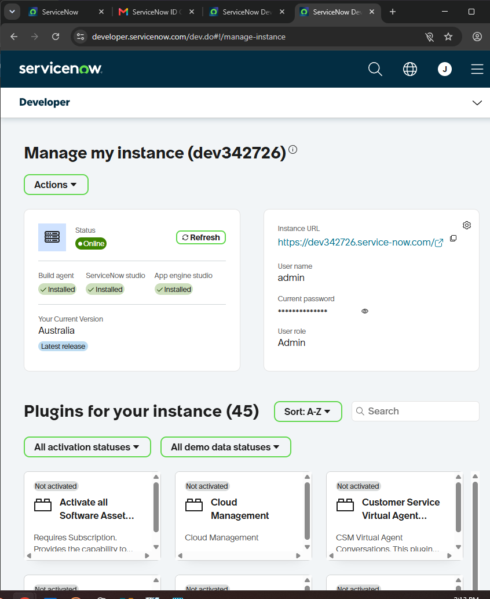
* **Caption:** Associating the target configuration item (CI) and designating ownership to the specialized hardware assignment pool.
* **Technical Context:** Linked the ticket to the affected host asset `ANNIE-IBM` and assigned it to the Hardware group. This mapping ensures end-to-end accountability and grounds the ticket within the corporate infrastructure index.

### Step 4: Outlining the Incident Scope

* **Caption:** Documenting diagnostic technical descriptions and error metrics for immediate engineering evaluation.
* **Technical Context:** Inputted clear, standardized prose regarding the server dropout symptoms. This data provides immediate contextual clarity for arriving specialists, eliminating redundant diagnostic discovery.

### Step 5: Incident Record Verification

* **Caption:** Verifying successful creation of the live incident tracking record (INC0009005) inside the active service queue.
* **Technical Context:** Audited the master incident database view to confirm transactional commitment of the ticket. The record is now officially live, visible to stakeholder dashboards, and tracked against active Service Level Agreements (SLAs).

### Step 6: Initializing the Root-Cause Investigation

* **Caption:** Transitioning from reactive service restoration to proactive problem analysis by instantiating a blank Problem record.
* **Technical Context:** Generated a new tracking matrix entry inside the `problem` table array. This separates immediate tactical firefighting from long-term, systemic structural investigation.

### Step 7: Structuring the Problem Scope

* **Caption:** Correlating the root-cause ticket to the affected server asset and mapping corporate engineering ownership.
* **Technical Context:** Inputted `ANNIE-IBM` as the primary configuration item. This explicit mapping links the problem record to the organization’s asset topology, ensuring all downstream investigations stay pinned to the correct machine.

### Step 8: Documenting Systemic Failure Symptoms

* **Caption:** Inputting analytical descriptions detailing the repetitive server dropout patterns for cross-functional review.
* **Technical Context:** Documented the recurring nature of the network drops. Standardizing this data helps identify broader trends across multiple incidents and isolates isolated anomalies from widespread infrastructure degradation.

### Step 9: Creating the Multi-Module Thread
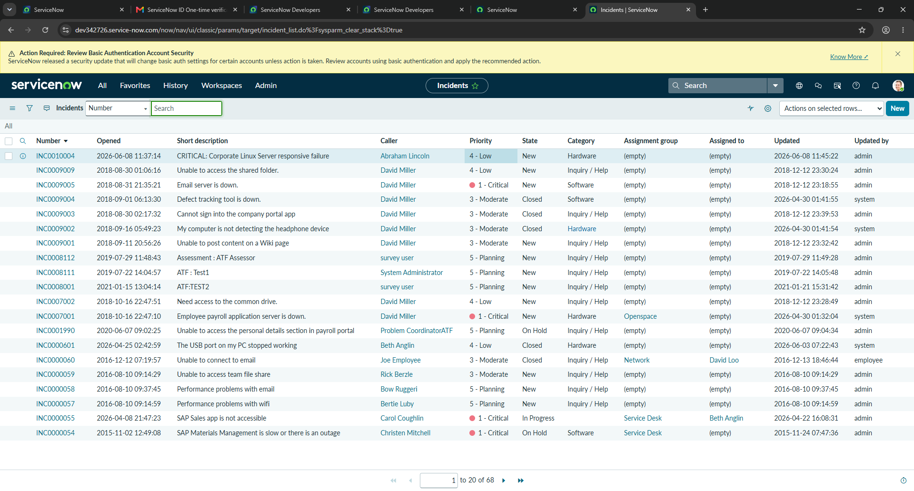
* **Caption:** Executing a relational database join by linking the original Incident ticket directly into the Problem investigation ledger.
* **Technical Context:** Appended `INC0009005` to the Problem's related records list. This establishes a bidirectional data link, allowing future resolutions to automatically update or close all connected incidents simultaneously.

### Step 10: Committing the Problem Ticket
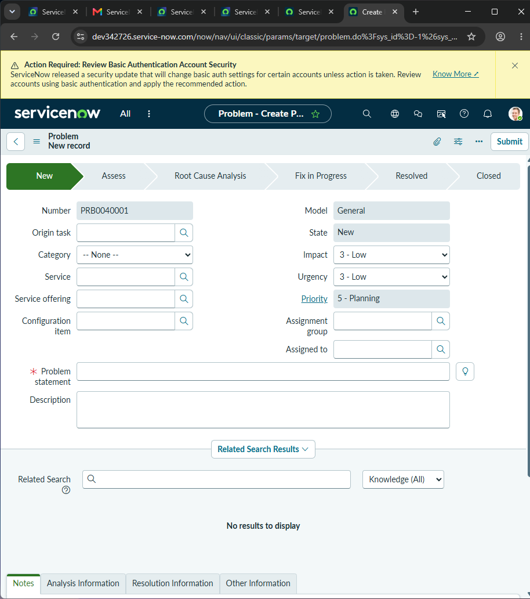
* **Caption:** Confirming the live creation of Problem record PRB0040001 within the master global ledger view.
* **Technical Context:** Validated the backend write-action by auditing the active problem list view. The record is now formally positioned within the corporate problem pipeline for deeper root-cause evaluation.

### Step 11: Documenting Root Cause & Workaround
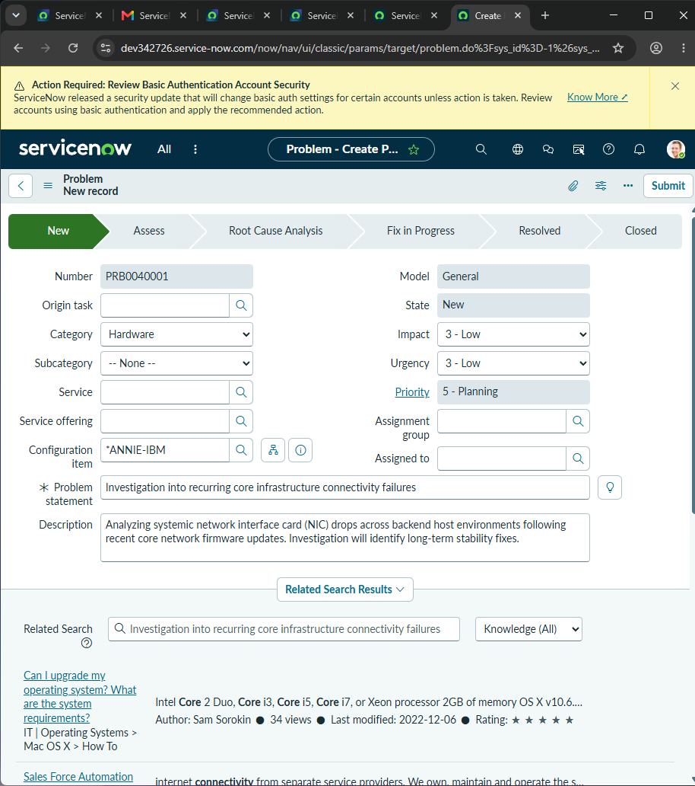
* **Caption:** Staging validated technical workarounds and documenting the physical root cause within the Problem record.
* **Technical Context:** Formally isolated the failure to a degraded network interface card (NIC). Documenting the workaround ensures operational teams can mitigate future drops while a permanent fix is prepared.

### Step 12: Initializing the Permanent Fix Workflow
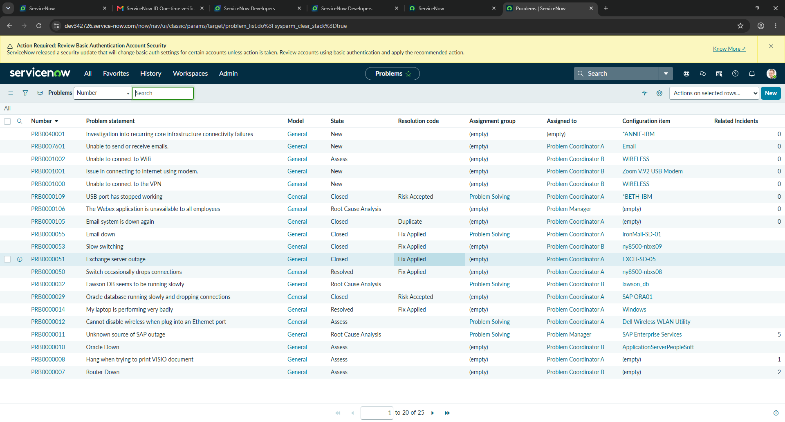
* **Caption:** Launching the Change Management pipeline directly from the validated Problem record to initiate infrastructure remediation.
* **Technical Context:** Leveraged UI actions to instantiate a new record in the `change_request` table. This preserves data lineage across all three ITIL modules, linking the final fix directly to the problem and original incident.

### Step 13: Change Template Selection
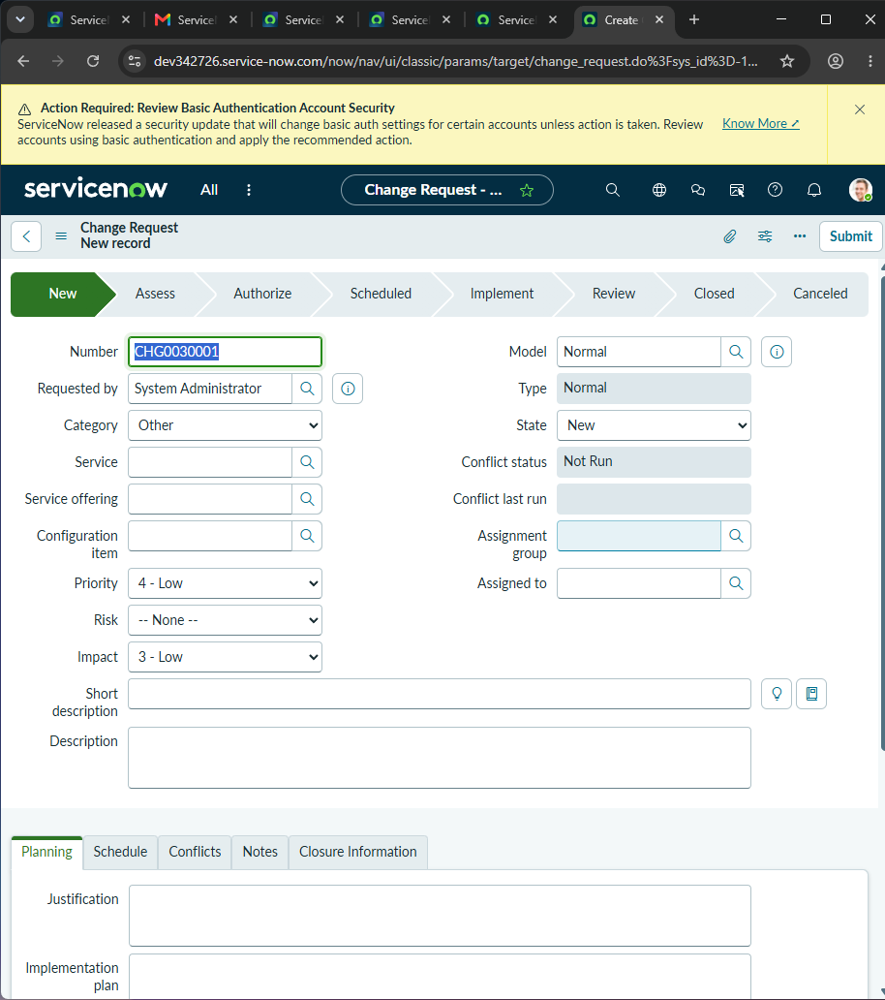
* **Caption:** Navigating the Change Management landing panel to select the appropriate risk and governance model.
* **Technical Context:** Initialized the change creation workspace. Selecting a structured change path ensures the deployment conforms to established enterprise workflows and automated risk-evaluation logic.

### Step 14: Mapping the Change Implementation Plan
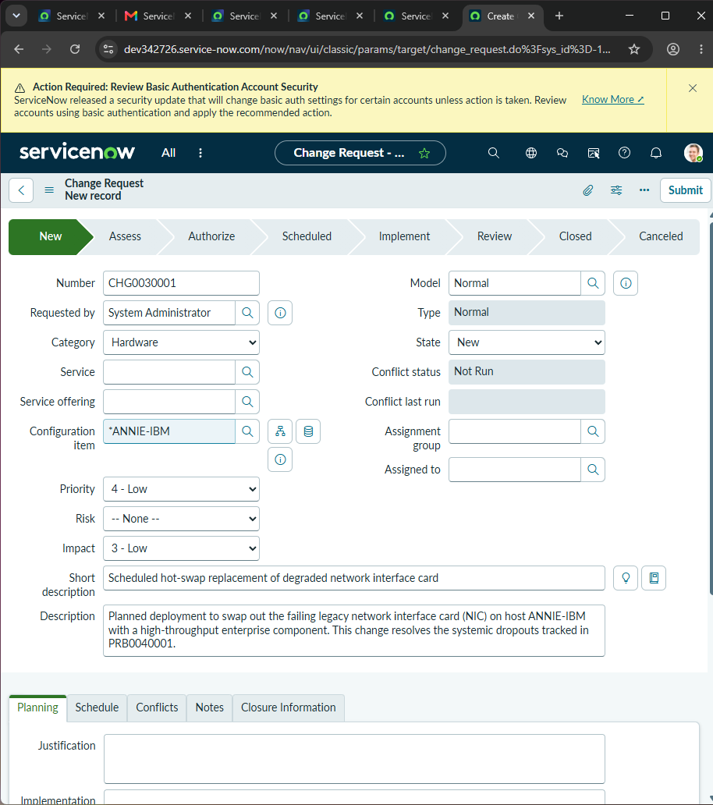
* **Caption:** Inputting scheduling parameters, risk assessments, and hardware scope details for the planned network card hot-swap.
* **Technical Context:** Field-mapped a comprehensive risk mitigation and deployment blueprint within the Change record. Associating the specific configuration item (CI) ensures that the automated risk engine can evaluate downstream dependencies, conflict schedules, and maintenance windows to minimize potential downtime.

### Step 15: Change Log Queue Verification
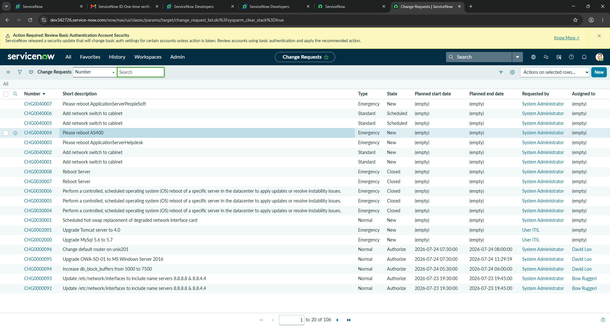
* **Caption:** Verifying successful transactional commitment of the infrastructure change request inside the global tracking matrix.
* **Technical Context:** Validated the backend database write-action by auditing the global `change_request` table array. The successful generation of the live tracking record confirms that the proposed deployment is now queued for administrative review, technical vetting, and scheduling coordination within the enterprise change pipeline.

### Step 16: CMDB Server Asset Initialization
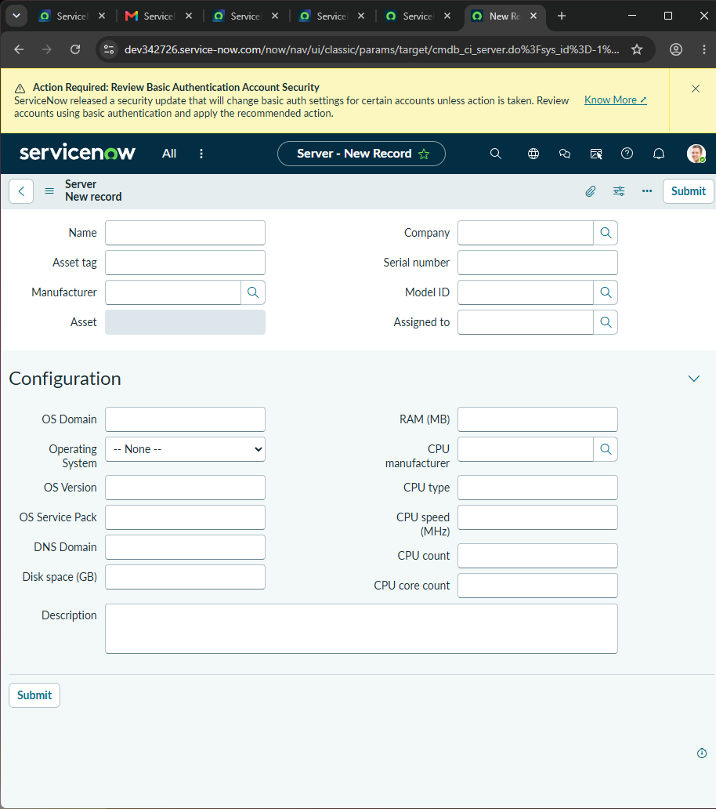
* **Caption:** Launching a new Configuration Item (CI) schema within the enterprise Configuration Management Database (CMDB).
* **Technical Context:** Opened an unpopulated asset record row inside the `cmdb_ci_server` class table. Populating the CMDB allows the organization to track physical and virtual hardware assets, map architectural dependencies, and evaluate business service impacts when an outage occurs.

### Step 17: Registering Infrastructure Configuration Data
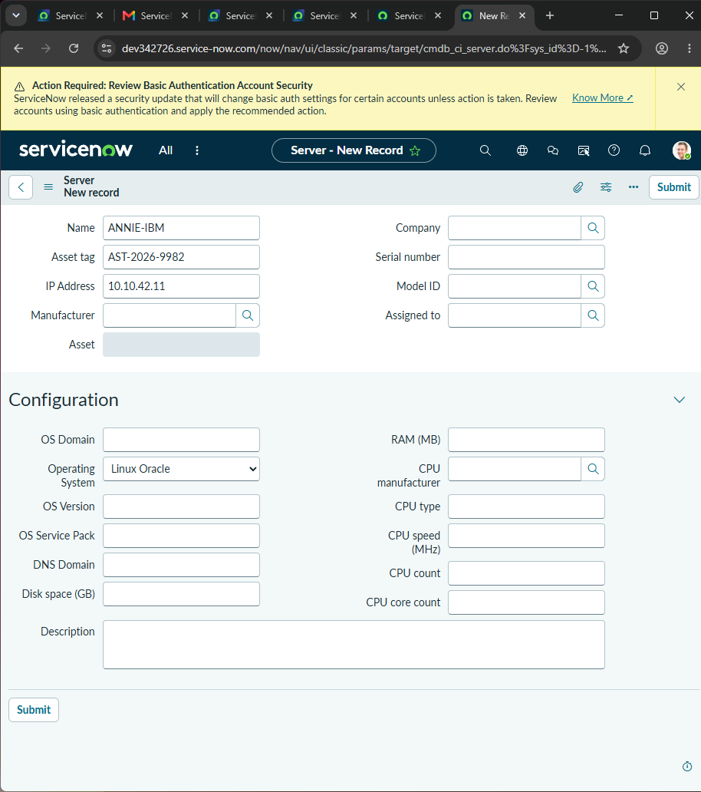
* **Caption:** Committing logical network, hardware identity, and asset tracking tags to the active Linux production server record.
* **Technical Context:** Field-mapped data onto the `cmdb_ci_server` class schema. By provisioning core metrics like IP addresses and dedicated asset tags, the system bridges the gap between raw hardware inventory and the ITIL operational ticketing workspace, enabling automated configuration tracking.

### Step 18: Mapping CMDB Dependency Topology
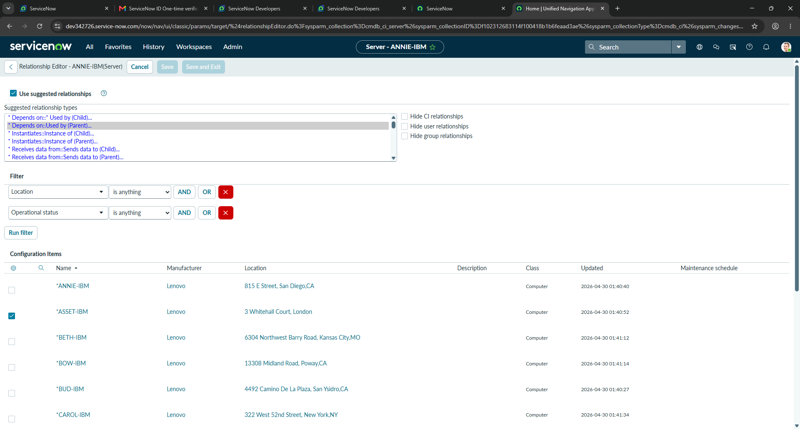
* **Caption:** Establishing a logical configuration relationship between the production server and upstream network infrastructure dependencies.
* **Technical Context:** Configured an active row link within the `cmdb_rel_ci` table schema. Mapping these relationships creates an interconnected dependency tree, giving incident responders and change managers a visual topology map to predict downstream impacts before pulling hardware or performing maintenance.

### Step 19: CMDB Asset Registry Verification
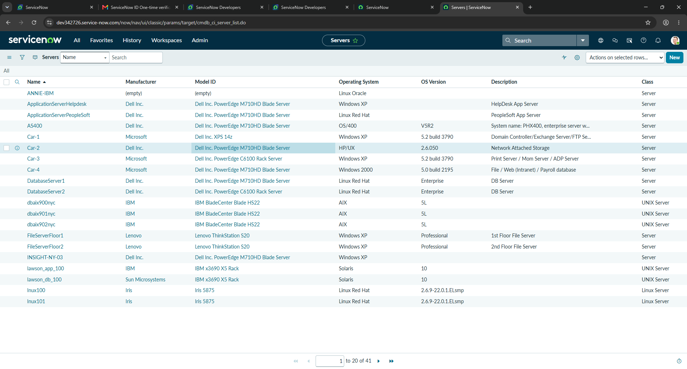
* **Caption:** Verifying successful transactional inclusion of the newly provisioned host asset within the production server table ledger.
* **Technical Context:** Audited the global `cmdb_ci_server` database index to confirm successful insertion of the custom asset. This verification step ensures the configuration item is fully discoverable across the ITSM ecosystem, enabling seamless cross-referencing for future incident logging, root-cause analyses, or change request auditing.
